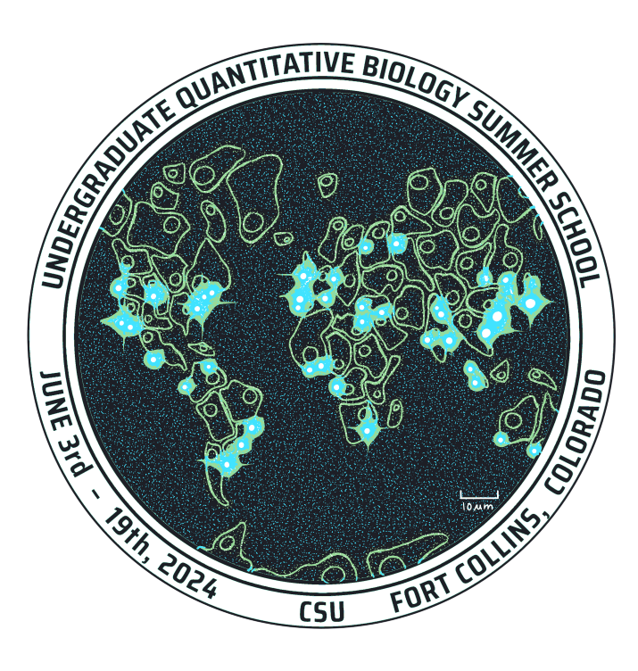

# UQ Bio Paper
Authors: Luis Aguilera

[](https://opensource.org/licenses/BSD-3-Clause)

# Description

<div style="display: flex; align-items: center;">
    
    <div>
        This repository contains all the codes needed to reproduce the images in the qbio paper.
    </div>
</div>

# Installation 

## Installation on a local computer

To install this repository and all its dependencies. We recommend installing [Anaconda](https://www.anaconda.com). 

* Clone the repository.
```sh
git clone https://github.com/luisub/qbio_paper.git
```

* To create a virtual environment, navigate to the location of the requirements file, and use:
```sh
 conda create -n qbio_paper_env python=3.10 -y
 conda activate qbio_paper_env

* To include the rest of the requirements use:
```sh
 pip install -r requirements.txt
```

Additional steps to deactivate or remove the environment from the computer:

* To deactivate the environment, use
```sh
 conda deactivate
```
* To remove the environment use:
```sh
 conda env remove -n qbio_paper_env
```
